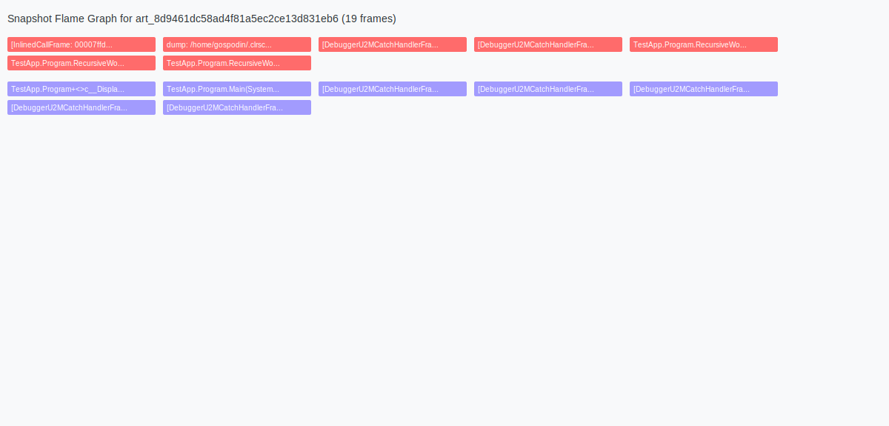

# Investigation Guides

This document provides step-by-step guides for common diagnostic scenarios using CLRScope MCP.

## Automated Workflows

CLRScope MCP provides automated workflows that execute multiple diagnostic collection steps in sequence, returning structured results with all collected artifacts.

### Available Automated Workflows

- **workflow_automated_high_cpu_bundle**: Collects CPU trace, performance counters, and thread stacks
- **workflow_automated_memory_leak_bundle**: Collects GC dump, GC counters, and GC heap trace
- **workflow_automated_hang_bundle**: Collects memory dump, thread stacks, and thread counters
- **workflow_automated_baseline_bundle**: Collects counters, baseline trace, GC dump, and thread stacks

### Using Automated Workflows

Automated workflows simplify the diagnostic process by executing all necessary collection steps automatically:

```json
{
  "pid": 12345,
  "duration": "00:01:00"
}
```

Each workflow returns:
- Success status
- Steps completed / total steps
- Array of collected artifacts with metadata
- Session IDs for tracking
- Execution time in milliseconds
- Error information if any steps failed

## Manual Investigation Guides

For more granular control or when automated workflows are not suitable, use the following manual step-by-step guides.

## High CPU Investigation

Step-by-step guide for high CPU investigation:

1. Use `runtime_list_targets` to find the .NET process with high CPU usage
2. Use `runtime_inspect_target` to verify the process is .NET and get details
3. Use `collect_trace` with `cpu-sampling` profile for 30-60 seconds to capture CPU activity
4. Use `collect_counters` with `System.Runtime` provider to get CPU and thread metrics
5. Use `collect_stacks` to capture a snapshot of thread stacks
6. Open the trace in PerfView or `dotnet-trace analyze` to identify hot methods
7. Look for methods with high CPU time in the trace
8. Check thread pool configuration and contention in counters
9. Review stack traces to identify blocking patterns

**Alternative**: Use `workflow_automated_high_cpu_bundle` for automated collection.

## Memory Leak Investigation

Step-by-step guide for memory leak investigation:

1. Use `runtime_list_targets` to find the .NET process with high memory usage
2. Use `runtime_inspect_target` to verify the process is .NET and get details
3. Use `collect_gcdump` to capture GC heap snapshot
4. Use `collect_counters` with `System.Runtime` provider to get GC metrics
5. Use `collect_trace` with `gc-heap` profile to capture allocation activity
6. Use `visualize_heap_snapshot` with the gcdump artifact for type distribution analysis (v1.2.0)
7. Use `visualize_heap_snapshot` with diff view to compare baseline vs issue gcdumps (v1.2.0)
8. Use `visualize_heap_snapshot` with retainer paths to identify object retention chains (v1.2.0)
9. Check heap size and generation distribution
10. Identify top types by size and count
11. Look for large object arrays or strings
12. Check GC pause times in counters
13. Review allocation rate in trace

**Alternative**: Use `workflow_automated_memory_leak_bundle` for automated collection.

**Note (v1.2.0):** For heap visualization, use .gcdump files (reliable) instead of .nettrace (unreliable for heap data).

## Hang/Deadlock Investigation

Step-by-step guide for hang/deadlock investigation:

1. Use `runtime_list_targets` to find the .NET process that is hung
2. Use `runtime_inspect_target` to verify the process is .NET and get details
3. Use `collect_dump` to capture a full memory dump
4. Use `collect_stacks` to capture managed thread stacks
5. Use `collect_counters` with `System.Runtime` provider to get thread metrics
6. Use `analyze_dump_sos` with `threads` command to list all threads
7. Use `analyze_dump_sos` with `clrstack` command to get stack traces for each thread
8. Use `visualize_flame_graph` with the dump artifact to generate a snapshot flame graph (v1.2.0)
9. Optionally use the `filename` parameter to automatically save and open the visualization in your default browser
10. Look for threads blocked on locks, monitors, or wait handles
11. Check for deadlock patterns (circular wait chains)
12. Review thread pool queue length and worker threads
13. Check for async/await deadlocks or thread pool starvation

**Alternative**: Use `workflow_automated_hang_bundle` for automated collection.

### Flame Graph Visualization Example

The `visualize_flame_graph` tool generates compact flame graphs showing thread call stacks. Here's an example of a flame graph visualization:



**Features:**
- Fixed-width rectangles (200px) for better readability
- Color-coded by thread ID
- Unique call sites only (no duplicates)
- Automatic XML escaping for special characters
- Optional `filename` parameter for auto-saving and opening in browser

**Usage example:**
```json
{
  "artifactId": "art_8d9461dc58ad4f81a5ec2ce13d831eb6",
  "autoAnalyze": "true",
  "flameKind": "snapshot",
  "format": "svg",
  "filename": "/tmp/flame-graph.svg"
}
```

## Baseline Performance Collection

Plan for collecting baseline performance data:

1. Use `runtime_list_targets` to identify the target process
2. Use `runtime_inspect_target` to verify the process is .NET and get details
3. Use `collect_counters` with `System.Runtime` provider for 60 seconds to capture baseline metrics
4. Use `collect_trace` with default profile for 60 seconds to capture baseline trace
5. Use `collect_gcdump` to capture baseline GC heap snapshot
6. Use `collect_stacks` to capture baseline thread stacks
7. Save the collected artifacts with descriptive names (e.g., `baseline_cpu.trace`, `baseline_counters.json`)
8. Document the system conditions (CPU, memory, load) during baseline collection
9. Store baseline artifacts in a dedicated folder for comparison with future collections
10. Use `import_gcdump` to import baseline gcdumps for later comparison (v1.2.0)

**Alternative**: Use `workflow_automated_baseline_bundle` for automated collection.
